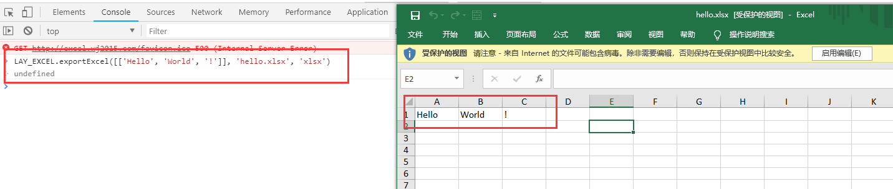

# 快速上手

> 由于插件规模扩大和功能的增加，导致插件上手难度有一定的增加。但如果只使用核心功能，其实没有必要去研究插件的所有方法，故在此把此插件解决核心需求的方法展示出来。

#### 试一试：一句话导出 Hello World

> 在 [http://excel.wj2015.com](http://excel.wj2015.com) 下按 F12 弹出 console 调试工具，然后在里边输入如下命令，下载完毕后打开看到如下结果就说明成功了

```javascript
LAY_EXCEL.exportExcel([['Hello', 'World', '!']], 'hello.xlsx', 'xlsx')
```



>  PS：这个就是核心的导出功能，**第一个参数是一个二维数组**，**第二个参数是导出文件名**，**第三个参数是文件类型**，是不是特别简洁，有一定JS基础的童鞋相信一眼就能看懂！下面继续介绍如何与 AJAX 结合，导出后端给到的数据。

#### 第一步：从后台获取需要导出的数据

> 一般的导出场景是后端给出获取数据的接口，前端请求后端接口后，根据接口返回参数导出，所以需要 $.ajax() 异步请求接口数据

```javascript
$.ajax({
    url: '/path/to/get/data',
    dataType: 'json',
    success: function(res) {
        // 假如返回的 res.data 是需要导出的列表数据
        console.log(res.data);// [{name: 'wang', age: 18}, {name: 'layui', age: 3}]
    }
});
```

#### 第二步：下载源码并引入插件

如果使用 `layuiadmin`，本插件的使用方式与其他插件别无二致，具体引用方法请查看其文档（PS: 在需要的地方 script 引入进来多方便）

Layui项目，非 `layuiadmin` 的插件初始化如下：

```javascript
layui.config({
	base: 'layui_exts/',
}).extend({
    excel: 'excel',
});
```

**PS: 现已支持直接引入JS文件的方式加载插件，然后通过 LAY_EXCEL 全局变量调用相关函数了，非LAYUI或者不熟悉LAYUI的插件加载机制的童鞋可以在HTML文件中通过 script 标签引入，如：**

```html
<!--加载插件-->
<script src="../../layui_exts/excel.js"></script>
<!--直接调用函数即可-->
<script>
    LAY_EXCEL.exportExcel([[1, 2, 3]], '表格导出.xlsx', 'xlsx')
</script>
```

**PS: 现也支持 npm 引入，如果用的 vue / React 系列的前端框架，可使用如下引入，为 vue 做了一个 demo 可参考：[lay-excel-vue](https://github.com/wangerzi/lay-excel-vue)**

```shell
$ npm i lay-excel
```

然后使用 `import` 引入并调用导出函数

```js
import LAY_EXCEL from 'lay-excel';
LAY_EXCEL.exportExcel([[1, 2, 3]], '表格导出.xlsx', 'xlsx')
```

> ！！！注：千万千万千万不要功能演示中的地址作为 CDN 使用，作者联系了 layuicdn 提供专业免费的 CDN 服务，版本可能并非最新，有需要最新版本CDN服务请群内联系我
>
> v1.6.5 CDN地址：https://www.layuicdn.com/extend/excel/1.6.5/layui_exts/excel.min.js

#### 第三步：手工添加一个表头，调用导出excel的内部函数

> 非layui框架请直接使用 $.ajax 和 LAY_EXCEL 进行异步操作和导出
>
> ！！！注意：无论单元格是否空白，在调用 exportExcel 之前每一行的 key 必须顺序相同且数量一致，否则容易出现错位、样式渲染异常等情况！！！

```javascript
layui.use(['jquery', 'excel', 'layer'], function() {
    var $ = layui.jquery;
    var excel = layui.excel;
    $.ajax({
        url: '/path/to/get/data',
        dataType: 'json',
        success: function(res) {
            // 假如返回的 res.data 是需要导出的列表数据
            console.log(res.data);// [{name: 'wang', age: 18, sex: '男'}, {name: 'layui', age: 3, sex: '女'}]
            // 1. 数组头部新增表头
            res.data.unshift({name: '用户名',sex: '男', age: '年龄'});
            // 2. 如果需要调整顺序，请执行梳理函数
            var data = excel.filterExportData(res.data, [
                'name',
                'sex',
                'age',
            ]);
            // 3. 执行导出函数，系统会弹出弹框
            excel.exportExcel({
                sheet1: data
            }, '导出接口数据.xlsx', 'xlsx');
        }
    });
});
```